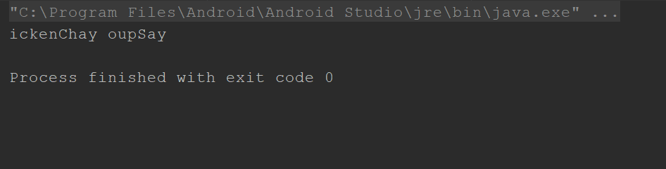

# Week5Daily5TestAssignment_Part1
PigLatin. A made-up language formed from English by transferring the initial consonant or consonant. Cluster of each word to the end of the word and adding a vocalic syllable (usually ˈpiɡ ˌlatn: so chicken soup would be translated to ickenchay oupsay . Pig Latin is typically spoken. playfully, as if to convey secrecy.

Output of the pig latin problem.

Kelvin
